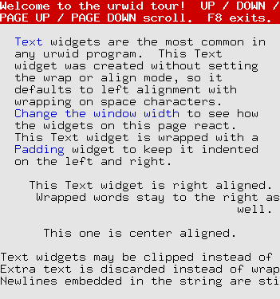

This is a Title
===============





* this is


```
$ echo "ls ./"
```

* a list

  * with a nested list
  * and some subitems


.. code:: sh

    $ echo "ls ./"

* and here the parent list continues


.. code:: python

    import os
    print "hello world"
